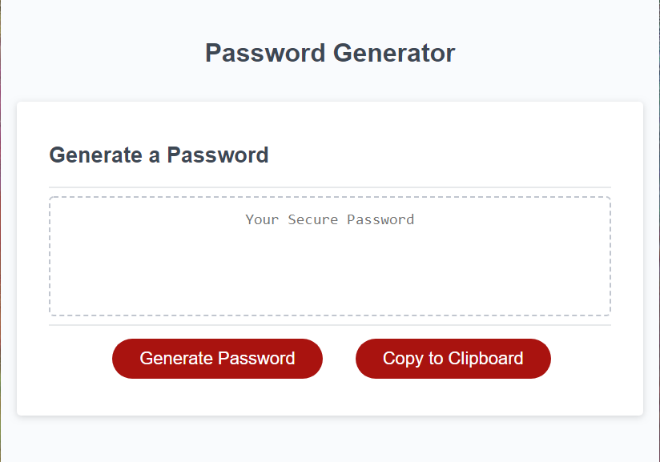
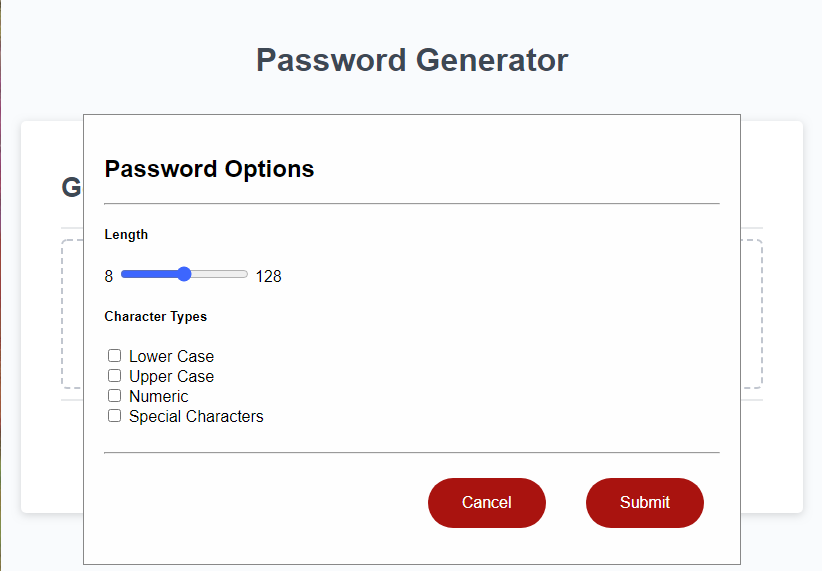
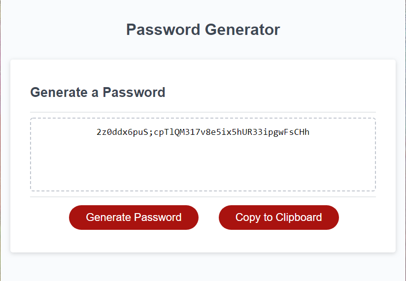

# PasswordGenerator

## Table of Contents

- [Introduction](#introduction)
- [Technologies](#technologies)
- [Launch](#launch)
- [Images](#images)
- [Issues](#issues)
- [To Do](#to-do)

## Introduction

My task is to utilize given code to create an application that an employee can use to generate a secure password based on selectors they choose. This app will run in the browser, and will feature dynamically updated HTML and CSS powered by JavaScript code that I write.

The password can include special characters following guidelines from [OWASP Fondation](https://www.owasp.org/index.php/Password_special_characters).

The Acceptance Criteria is as follows.

- [x] Generates a new secure password.
- [x] Prompts the user for password criteria.
- [x] Choose length between 8 and 128.
- [x] Choose types from Lower Case, Upper Case, Numeric, and Special Characters.
- [ ] Validates the users choices.
- [x] It shows the generated password in the center box.

## Technologies

Project is created with:

- HTML
- CSS
- JavaScript

## Launch

- [GitHub Repository](https://github.com/Connerjm/PasswordGenerator)
- [Deployment](https://connerjm.github.io/PasswordGenerator/)

## Images

The initial state of the application.

The popup that askes the user for the password options.

The generated password.

## Issues

None at present.

## To Do

- Validate user input?
- Add the option to use words instead of just characters?
